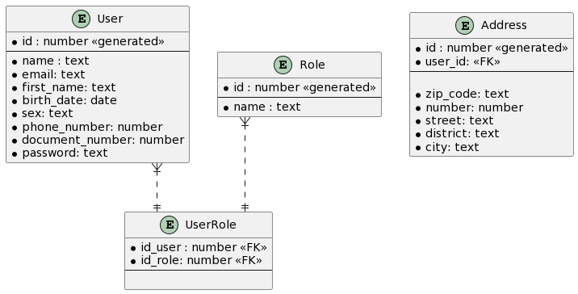

### Projeto Seven Gardens

### Database

### Como rodar o projeto no ambiente local 
1- Inicializar o servidor apache no painel do xampp

2- Iniciar o banco Msyql no painel do xampp

3- Copiar o conteúdo da pasta seven-gardens que vai conter o design do front-end e as logícas do back-end com php para a pasta do htdocs do xampp 

4- Acessar a url no browser
http://localhost/seven-gardens/

5- Crie um novo database chamado de seven_gardens_db

6- Execute o script na pasta scripts para deixar o seu banco local com a versão mais atual.
Sempre que houverem mudanças no banco o script deverá ser atualizado

#### Descrição dos componentes
- seven-gardens\config.php - Responsável por abrir as conexões com o banco de dados
- seven-gardens\src\database\users.php - Responsável por realizar as operações usando o sql e o banco de dados do xampp

